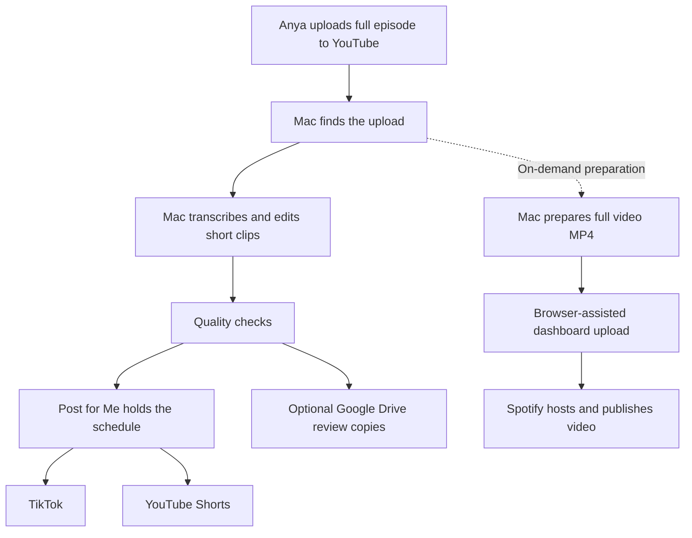

# PURSUIT: Services, Costs, and What You Do

Deployment snapshot and prices checked: **October 8, 2026**. All schedules use **America/Denver** time. This page explains the existing Mac deployment; it does not enable or change any posting settings.

## TL;DR

**Anya uploads the original to YouTube. The Mac makes clips, and Post for Me publishes them to TikTok/Shorts. Spotify preparation now defaults to full video MP4 and details; dashboard uploads still need assistance. The existing live episode remains audio until replaced with video. Spotify still hosts the show. GitHub stores the code and instructions.**

**Expected service cost at current small usage: about $10/month, plus the existing ChatGPT Plus subscription (Codex).** The $10 is Post for Me. Cloudflare should currently fit its free allowances. Spotify, YouTube, TikTok, and this GitHub repository add no required publishing subscription for this setup. This is an estimate before taxes, not a complete account invoice or spending cap.

**Spotify status:** [the real 8:48 episode](https://open.spotify.com/episode/2edCtALCfvqG6gR5WlwqsH) is confirmed Published in the existing show through the dashboard. Spotify hosting is unchanged. The Cloudflare redirect was cancelled and that branch is OFF. The remaining task is a reliable unattended dashboard uploader, not moving the show to another host.

## Spotify Hosting and Monetization

The issue is the selected hosting method. Our custom RSS route automatically distributes audio, but Spotify's final redirect screen explicitly says the show will no longer qualify for ads monetization on Spotify for Creators. That affects those built-in monetization tools, not every possible source of income; direct sponsor arrangements and earnings on other platforms are separate.

| Path | Publishing workflow | Monetization implications |
| --- | --- | --- |
| Keep Spotify hosting | Code now prepares full video/copy; an audio dashboard upload has succeeded. Unattended repetition is not yet implemented | Preserves the hosting requirement; eligible video adds Premium video revenue opportunities |
| Use our Cloudflare RSS feed | Code can publish full audio automatically; Spotify imports the connected feed | The redirect warning removes this show's Spotify-hosted ads eligibility; external sponsorship income is separate |
| Use an approved Spotify integration partner | Depends on that provider's supported automation and pricing | Some partners support eligible video monetization; not every external host does |

Spotify currently lists hosting, audience, episode and market requirements for its program; simply uploading does not guarantee earnings. Approved partner integrations are also available. Our own Cloudflare feed is not an approved partner integration. [Spotify Partner Program](https://support.spotify.com/us/creators/article/spotify-partner-program/), [Spotify's partner integrations](https://creators.spotify.com/resources/news/expanding-video-partners-and-platforms).

**Current recommendation:** keep Spotify hosting while Anya decides about monetization. Do not apply the permanent redirect or turn on the Cloudflare publishing branch merely to finish setup. The existing code, cover and verified MP3 remain usable; the work is not lost.

**Anya's monetization steps:** open Spotify's Monetize section, confirm her location/account type, track eligibility and apply when eligible. After approval, complete payouts and configure ad breaks. Current application requirements include an eligible legal address, Spotify hosting, 3 published episodes, 2,000 consumption hours and 1,000 audience count in the last 30 days. These rules can change; the dashboard is authoritative. Eligible audio can earn ad revenue, but Premium video revenue requires video. The current MP3 does not earn Premium video revenue. [Official requirements and payout steps](https://support.spotify.com/us/creators/article/spotify-partner-program/).

## What Each Thing Does

| Thing | Plain-English job | Where it runs | When you need it |
| --- | --- | --- | --- |
| YouTube full episodes | The original video and the starting point for all distribution. | YouTube | Anya uploads each original episode here. |
| Our Python program / autopilot | Finds uploads, prepares content, checks quality, and sends finished files to the right service. | Your Mac | Automatically during scheduled runs; manually for troubleshooting. |
| macOS LaunchAgent | The alarm clock that starts the program at configured times. | Your Mac | Keep it installed; the Mac must be awake and online to do new work. |
| Codex CLI (Claude Code optional, off by default) | Helps choose useful short moments and assess whether the clips make sense. | Called from the Mac using the ChatGPT-subscription login (no API key) | Maintain its subscription/login and available usage. |
| Whisper, FFmpeg, OpenCV, yt-dlp | Transcribe speech, edit/convert files, inspect video, and retrieve the source episode. | Your Mac | No separate paid account; occasionally update them when downloading breaks. |
| Post for Me | Receives finished clips, holds their schedules, and posts them to the connected social accounts. | Post for Me's servers | Maintain one subscription and the TikTok/YouTube connections. |
| TikTok | Where viewers see the short clips. | TikTok | Check results, comments, and any account issues. |
| YouTube Shorts | Another destination for the short clips, on the existing PURSUIT YouTube channel. | YouTube, published through Post for Me | Review results and optionally set the Related video field. |
| Cloudflare R2 | The online shelf that stores the full MP3s, cover image, and episode list. | Cloudflare | Maintain the account/billing; check usage occasionally. |
| Cloudflare Worker | Serves the separate, optional RSS feed and MP3 files. | Cloudflare, at our `workers.dev` address | Deployed but not connected to this Spotify show; no domain purchase needed. |
| RSS feed | A public episode list with show details and MP3 links, not another subscription. | Generated by our code and served through Cloudflare | Optional external-hosting route only; do not connect it to the current Spotify-hosted show. |
| Spotify for Creators / Spotify | Hosts uploaded episodes, playback, analytics and eligible monetization. | Spotify | Dashboard upload per episode for now; check Monetize for eligibility. |
| Google Drive | Optional review copies of finished Shorts and their posting text. | Google Drive | Use when Anya wants to inspect or manually reuse a clip. |
| GitHub | The shared code, change history, and instruction manual. | GitHub | Read setup instructions and keep code changes recorded. It does not run the daily program. |

Cloudflare stores and serves the podcast files. Our code decides what to publish and creates the RSS feed. Post for Me handles the short social videos, not Spotify audio. There is no additional managed podcast-host subscription in this workflow.

Earlier details about Post for Me's operator, account permissions and disconnecting YouTube are preserved in [Post for Me Background](POSTFORME.md). They are reference material, not another required service or setup task.

## Monthly Costs

| Item | Expected cost for this setup | What could change it |
| --- | --- | --- |
| Post for Me | **$10/month** baseline | A different account tier or substantially increased posting volume. Check your actual invoice. |
| Cloudflare R2 | **$0 initially** | Storage and file operations above its free allowances are billed automatically. |
| Cloudflare Worker | **$0 on the current Free plan** | Free-plan limits can stop requests. A deliberate upgrade to Workers Paid starts at $5/month, plus possible usage charges. |
| Spotify | **$0 required for publishing/listing** | Optional monetization products are outside this setup. |
| YouTube / TikTok | **$0 additional publishing fee** | Ads, promotions, and optional products are not included. |
| GitHub repository | **$0 additional required** | Paid development services or account upgrades are separate. No daily GitHub-hosted processing is configured. |
| Google Drive review copies | **$0 additional if existing storage is sufficient** | Google storage upgrades, if needed. |
| Local media tools | **$0 software subscription** | Mac storage, electricity, and internet still belong to your normal operating costs. |
| ChatGPT Plus (Codex) | **Existing plan price; not verified here** | The pipeline consumes its normal usage allowance. A larger plan may be needed if usage grows. |

Budget formula: **Post for Me + any Cloudflare overages + existing ChatGPT Plus plan + any optional storage/development subscriptions**. The roughly $10 estimate is the service budget before the existing ChatGPT Plus plan, taxes, hardware, internet, and optional extras. We have not audited every personal subscription on the account.

Post for Me currently advertises $10/month for up to 1,000 successful posts. Our ceilings of three TikToks/day and three Shorts/week are roughly 105 posts in a typical month, well below that allowance. Actual account billing is authoritative. [Post for Me pricing](https://www.postforme.dev/pricing).

### Cloudflare Without the Jargon

R2 Standard includes 10 GB-month of storage, one million write operations, and ten million read operations per month. Extra storage is $0.015/GB-month; additional operation blocks cost $4.50/million writes and $0.36/million reads. Download bandwidth has no egress fee. An operation is a file request, not a listener: one playback can make several requests. Billing is averaged/rounded according to Cloudflare's rules. [R2 pricing](https://developers.cloudflare.com/r2/pricing/).

At 160 kbps, one hour of audio is about 72 MB. These are approximate **storage-only** bills for audio kept for a full month:

| Hours of audio stored | Approximate size | R2 storage bill/month |
| --- | --- | --- |
| 100 | 7.2 GB | $0 |
| 200 | 14.4 GB | About $0.07-$0.08 |
| 500 | 36 GB | About $0.39 |
| 1,000 | 72 GB | About $0.93 |

Artwork, small file overhead, billing rounding and request charges are additional. On October 8, the live bucket had only about **11.5 MB**: the cover, one MP3 and the feed. That storage is comfortably inside the free allowance, but this is not a promise of a $0 invoice forever.

Workers Free allows 100,000 requests per day across the account. Hitting the Free limit can return errors rather than silently converting the account to a paid plan. R2 overages, by contrast, can bill the payment method already supplied. A budget alert is a notification, not a hard spending cap. [Workers pricing](https://developers.cloudflare.com/workers/platform/pricing/), [Workers limits](https://developers.cloudflare.com/workers/platform/limits/).

## What You Do for Each Platform

| Destination | Current state | Program handles | Human handles |
| --- | --- | --- | --- |
| Full YouTube episode | The source for everything | Finds the upload after it is published | Record/edit the original, upload it, choose title/description and visibility |
| TikTok `@pursuitthepod` | Auto-posting enabled | Selects moments, edits/captions/checks clips and schedules up to 3/day at 9 AM, 3 PM and 9 PM | Maintain account connection; review quality/results; respond to comments |
| YouTube Shorts `@AnyaPostnikov` | Weekly publisher enabled | Prepares approved clips and schedules up to 3/week, Mon/Wed/Fri at 5 PM | Maintain connection; optionally select the full episode as Related video in YouTube Studio |
| Spotify | Signed in; real audio episode published; Spotify hosting preserved | Prepares full video and copy; MP3 is an explicit fallback | Dashboard upload/replacement is required until unattended repetition is implemented; do not redirect hosting |
| Google Drive review copies | Optional delivery enabled and test previously verified | Delivers up to 3 approved clips and posting text for each new episode; cleans tool-owned copies after 14 days | Review or download if useful; reauthorize Google if needed. Manual posting from Drive is optional |
| Instagram | Not established here as an active automatic destination | Code supports a later account-connection workflow | Connect and verify the intended account before adding automated Reels |

Posting counts are ceilings, not promises. Fewer suitable clips means fewer posts. There is no need to manually upload the automatically scheduled TikToks or Shorts. Posting a Drive copy manually can duplicate a clip already scheduled by Post for Me, so check before doing so.

**Discovery frequency:** the installed Mac job checks at 07:15, 10:15, 13:15, 16:15, 19:15 and 22:15 local Mac time (currently Denver), plus when the job loads. New work waits for an awake, online run and processing time. TikTok/Shorts use the posting slots above. **Spotify has no recurring upload job or promised delay yet**; the six daily checks do not publish Spotify episodes.

**YouTube's Related video step:** this code does not set that field. Choosing the full episode in YouTube Studio is a human step for Shorts that need it; the Short can publish without it. The captions already include the channel/full-episode direction where configured.

## Follow One Episode Through the System



The social path is scheduled; the Spotify dashboard step is currently assisted, not unattended. Cloudflare is a separate optional RSS route, disconnected from this show to preserve Spotify hosting.

## Current Spotify Publication and Next Steps

Completed: creator sign-in, full MP3 preparation and a successful dashboard upload of [How to be More Consistent Than 99% of People](https://open.spotify.com/episode/2edCtALCfvqG6gR5WlwqsH). Spotify confirms Published, Audio, 8:48. The 27-second "Delete this later" test was deleted with permission; the real episode is the sole remaining dashboard entry. Spotify hosting and monetization settings were not changed.

The separate Cloudflare server, cover, audio and RSS feed also work, but that feed is not connected to Spotify. Its automatic publishing switch remains OFF. There is no required RSS redirect for the direct dashboard route.

Remaining engineering work:

1. Make the successful dashboard workflow repeat unattended when a new eligible YouTube episode is detected. That uploader is not built or scheduled yet.
2. Add persistent duplicate checks, resumable uploads and verification that Spotify reports the intended episode Published before recording success.
3. Stop and request assistance when a sign-in challenge or unexpected page prevents safe completion. Never guess credentials or silently create another show.
4. Test that recurring workflow on a future episode before calling it automatic.

For now, code prepares full video and posting details, and an assisted dashboard upload can publish an episode. New episodes still need that dashboard step. Video stays local until uploaded to Spotify, not in the Cloudflare audio bucket; this adds local disk space and upload time, not a new hosting subscription. The current selection rule accepts regular YouTube videos at least six minutes long; it does not classify whether a video is an interview, vlog or solo podcast.

**Per-episode confirmation:** prepare with `./autopilot podcast-prepare latest --download`, upload `episode.mp4` and details to the existing show, confirm Published, Video and the correct title/duration, then check public video playback. Preparation preserves the full episode and framing, uses H.264/AAC MP4, and validates both tracks and duration. `--format audio` explicitly selects MP3 fallback. For the existing audio episode, replace with video instead of creating a duplicate. A prepared file or Cloudflare ledger entry is not Spotify publication. Before marking automation complete, a future YouTube upload must pass this whole sequence on a recurring job exactly once, with a saved Spotify episode ID and failures surfaced for attention.

[Spotify Setup](SPOTIFY_SETUP.md) retains the external-RSS deployment reference and monetization warning. Do not use its migration steps for the current Spotify-hosted route.

## Everyday Routine

**Anya:** publish the original episode to YouTube. Review outputs and comments/analytics as desired. Set Related video on Shorts where useful. Each full Spotify video still needs a dashboard upload until the unattended uploader is built. Once eligible, complete Spotify's monetization setup; video expands possible revenue streams but does not guarantee earnings.

**Samo:** keep the Mac running with internet and free disk space, maintain the Codex (ChatGPT)/Post for Me sign-ins and account connections, check status when something stalls, and review bills/Cloudflare usage periodically. Keep credentials private; GitHub contains instructions, not the live keys.

**Program:** watch for eligible uploads, prepare content, check it, track what has already been published and send it through the appropriate enabled branch. Post for Me handles submitted clip schedules. Spotify hosts dashboard-uploaded episodes. The separate Cloudflare files remain online, but their feed is not connected to Spotify.

## When the Mac Is Off or Something Breaks

| Situation | What continues | What waits / what to do |
| --- | --- | --- |
| Mac asleep/offline | Clips already submitted to Post for Me can still post; hosted podcast files remain online | New discovery, editing, MP3 conversion and submission wait until a later Mac run |
| Codex login/usage unavailable | Already submitted posts and hosted audio remain available; the audio branch does not use the AI | New AI clip selection/QC may wait; restore Codex login or wait for the usage limit to reset |
| Post for Me account disconnected | Cloudflare podcast hosting continues | Restore the intended social-account connection; inspect failed posts in Post for Me |
| Google Drive sign-in expired | Post for Me clip publishing and Cloudflare podcast publication are separate | Reauthorize Drive if review copies are wanted |
| YouTube downloading fails | Previously scheduled posts and existing audio stay available | Update the downloader or register an original source export |
| Cloudflare unavailable or limits reached | Social posts and Spotify-hosted episodes are independent | Restore the optional feed if needed; the current Spotify route does not depend on it |
| New episode missing on Spotify | Previously published Spotify-hosted episodes stay available | Complete/check the dashboard upload; there is no automatic feed import in the current route |

Useful commands in the current Mac deployment:

```bash
cd ~/Documents/PURSUIT_CLIPS_TOOL
./autopilot status
./autopilot podcast-status
./autopilot drive-status
```

`./autopilot pause` stops new scheduled local work. It does not cancel posts already held by Post for Me or remove podcast audio. To cancel a submitted social post, use Post for Me's dashboard. `./autopilot podcast-auto off` stops future podcast publication only; the current feed stays online.

## GitHub Versus the Live Mac

The live Mac has private settings, credentials, processing history and generated files. GitHub stores reviewed source changes and documentation. Pushing documentation does not change account permissions or activate posting.

**Source synchronization (October 8, 2026):** The Codex migration was committed to `main` as `521d0ca`, and the previously uncommitted Shorts/Drive modules, tests, and podcast source files were included. Claude is off by default; normal AI processing uses Codex authenticated through the existing ChatGPT subscription. Claude is only used if explicitly enabled with `PURSUIT_LLM=claude` or `PURSUIT_LLM_FALLBACK=claude`. A Codex failure or usage limit pauses AI processing until a later run rather than automatically switching to Claude.

The migration passed 136 automated tests and two real Codex smoke-test calls (transcript analysis and visual quality check). **End-to-end unattended scheduled runs are not yet verified**, so check at least one new-episode run and review clip quality before canceling Claude. The source is synchronized, but a fresh clone still needs Mac setup, private credentials, account connections, and runtime state; GitHub does not contain those files.

Keep this guide's snapshot updated whenever a service, schedule, price assumption or activation state changes. Use actual invoices for money, the Mac's status/configuration for enabled settings, and each destination's dashboard to confirm real publication.

## Source Links

For current prices and official setup: [Post for Me](https://www.postforme.dev/pricing), [R2](https://developers.cloudflare.com/r2/pricing/), [Workers](https://developers.cloudflare.com/workers/platform/pricing/), [GitHub Free](https://docs.github.com/en/get-started/learning-about-github/githubs-plans), [Spotify for Creators](https://creators.spotify.com/features/podcast).
