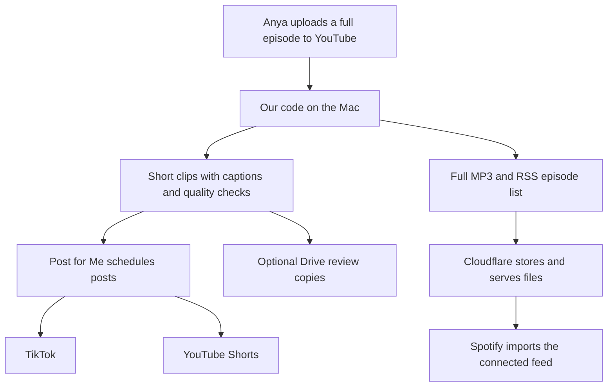

# Booboo Expansion Project

## Quick Read

PURSUIT's distribution program turns Anya's YouTube episodes into captioned TikToks, YouTube Shorts, and full podcast audio. It runs on the Mac; GitHub is the code and instruction manual.

**Monthly budget: about $10 plus the existing Claude subscription.** Cloudflare is expected to cost $0 at current usage, but storage/request overages can be billed. Taxes, optional upgrades and normal computer/internet costs are separate. Claude's exact plan price has not been verified.

| Tool | What it does | Monthly cost |
| --- | --- | --- |
| YouTube | Holds the original episodes and published Shorts | $0 additional required |
| Mac + our program | Downloads, transcribes, edits and converts files | $0 software fee |
| Claude | Selects and checks short moments | Existing subscription |
| Post for Me | Schedules and publishes TikToks and Shorts | $10 baseline |
| Cloudflare | Stores full MP3s and serves our RSS episode list | $0 expected initially; limits apply |
| Spotify | Imports the connected feed for listeners | $0 required |
| Google Drive | Optional review copies of Shorts | $0 extra with sufficient storage |
| GitHub | Stores code, history and these instructions | $0 extra required |

**Your normal job:** upload the original to YouTube and keep the Mac awake/online for new work. TikTok and weekly Shorts are enabled. Spotify still needs the existing show's feed connection and first import verified before automation is switched on. Shorts' Related video field is a manual step when wanted.

Prices checked October 8, 2026: [Post for Me](https://www.postforme.dev/pricing), [Cloudflare](https://developers.cloudflare.com/r2/pricing/). Detailed costs, schedules, setup and responsibilities are below.

---

## Deep Dive

### Current Deployment

**Where we are, October 8, 2026:**

| Destination | Current live Mac setting | What you do |
| --- | --- | --- |
| Original YouTube episode | Human upload; source for the program | Record/edit and upload the original episode |
| TikTok `@pursuitthepod` | Automatic posting enabled; up to 3/day at 9 AM, 3 PM and 9 PM Denver time | Maintain account connection and review results; no routine clip upload |
| YouTube Shorts `@AnyaPostnikov` | Weekly publisher enabled; up to 3/week, Mon/Wed/Fri at 5 PM Denver time | Maintain connection; set Related video in YouTube Studio when wanted |
| Spotify | First real audio/feed verified; Spotify connection pending; recurring publication OFF | Finish creator sign-in, connect the existing show to our feed, verify import, then enable automation |
| Google Drive | Optional review delivery enabled; previous test verified | Review/download copies if useful; refresh Google login if it expires |

Schedules are ceilings, not quotas: unsuitable or missing clips leave empty slots. The Mac must be awake and online to prepare new content. Clips already submitted to Post for Me can publish while it is off; existing Cloudflare audio remains available too.

**Read [Services, Costs, and What You Do](PROJECT_GUIDE.md)** for the detailed human guide: every service's purpose, monthly cost estimates, each platform's manual steps, what happens when the Mac is off, and the remaining Spotify setup. [Spotify Setup](SPOTIFY_SETUP.md) contains the technical account/deployment instructions.

For the earlier provider/security background, see [Post for Me and Connecting YouTube](POSTFORME.md).

## The Two Publishing Paths



The Spotify branch still needs its final account/feed connection. Our public [RSS feed](https://pursuit-podcast.endlesspursuits-co.workers.dev/feed.xml) already contains **How to be More Consistent Than 99% of People**. That confirms our hosting, not Spotify availability. There is an [existing PURSUIT Spotify show](https://open.spotify.com/show/2EOi7bHXVbBCbYJgXm6fWu); use it rather than creating a duplicate.

## What Each Thing Does

| Thing | Plain-English job | Where it runs | When you need it |
| --- | --- | --- | --- |
| YouTube full episodes | The original video and the starting point for all distribution. | YouTube | Anya uploads each original episode here. |
| Our Python program / autopilot | Finds uploads, prepares content, checks quality, and sends finished files to the right service. | Your Mac | Automatically during scheduled runs; manually for troubleshooting. |
| macOS LaunchAgent | The alarm clock that starts the program at configured times. | Your Mac | Keep it installed; the Mac must be awake and online to do new work. |
| Claude Code | Helps choose useful short moments and assess whether the clips make sense. | Called from the Mac using the logged-in Claude subscription | Maintain its subscription/login and available usage. |
| Whisper, FFmpeg, OpenCV, yt-dlp | Transcribe speech, edit/convert files, inspect video, and retrieve the source episode. | Your Mac | No separate paid account; occasionally update them when downloading breaks. |
| Post for Me | Receives finished clips, holds their schedules, and posts them to the connected social accounts. | Post for Me's servers | Maintain one subscription and the TikTok/YouTube connections. |
| TikTok | Where viewers see the short clips. | TikTok | Check results, comments, and any account issues. |
| YouTube Shorts | Another destination for the short clips, on the existing PURSUIT YouTube channel. | YouTube, published through Post for Me | Review results and optionally set the Related video field. |
| Cloudflare R2 | The online shelf that stores the full MP3s, cover image, and episode list. | Cloudflare | Maintain the account/billing; check usage occasionally. |
| Cloudflare Worker | Our small server that lets Spotify and listeners fetch files from that shelf. | Cloudflare, at our `workers.dev` address | Already deployed; no separate domain purchase needed. |
| RSS feed | A public episode list containing the show details and links to each MP3. It is a file, not another service or subscription. | Generated by our code and served through Cloudflare | Connect this stable address to Spotify once. |
| Spotify for Creators / Spotify | The creator dashboard manages the show; Spotify imports the feed so listeners can play episodes. | Spotify | Complete the current feed connection, then monitor imports and the show. |
| Google Drive | Optional review copies of finished Shorts and their posting text. | Google Drive | Use when Anya wants to inspect or manually reuse a clip. |
| GitHub | The shared code, change history, and instruction manual. | GitHub | Read setup instructions and keep code changes recorded. It does not run the daily program. |

Cloudflare stores and serves the podcast files. Our code decides what to publish and creates the RSS feed. Post for Me handles the short social videos, not Spotify audio. There is no additional managed podcast-host subscription in this workflow.

Earlier details about Post for Me's operator, account permissions and disconnecting YouTube are preserved in [Post for Me Background](POSTFORME.md). They are reference material, not another required service or setup task.

For the full budget, each platform's human steps and troubleshooting, see [Services, Costs, and What You Do](PROJECT_GUIDE.md). The technical reference below is retained for setup and maintenance.

## Technical Reference

The sections below cover installation, manual commands, account connections, testing and operation. The live Mac's settings and private files are separate from GitHub. Some earlier Shorts/Drive changes remain local and are not all committed, so the deployment snapshot above is not a claim that a fresh clone contains every live feature. See [GitHub versus the live Mac](PROJECT_GUIDE.md#github-versus-the-live-mac).

## Requirements

- Apple Silicon Mac (M1 or newer)
- macOS and Homebrew
- A Claude subscription with the Claude Code CLI logged in
- Approximately 2 GB for the Python environment and Whisper model, plus temporary space while an episode is processed
- For automatic publishing: your own Post for Me account/API key, the intended TikTok account, and the intended connected YouTube channel
- For optional Drive review delivery: a Google OAuth Desktop client with Drive access and a shared Drive folder
- For automatic audio distribution: Cloudflare R2, the included feed server and an existing-show connection in Spotify for Creators; see [Spotify Setup](SPOTIFY_SETUP.md)
- Instagram is optional; if automatic Reels publishing is added later, connect and verify the intended eligible Instagram account before enabling it

The current Mac uses the logged-in Claude Code subscription for clip selection/QC, rather than a separately configured Anthropic API key. Media processing is local. See [Monthly Costs](PROJECT_GUIDE.md#monthly-costs) for the service budget, limits and assumptions; the actual Claude plan and all account invoices have not been audited here.

## Installation

```bash
cd ~/Documents/PURSUIT_CLIPS_TOOL
./setup.sh
```

The setup script installs FFmpeg, `yt-dlp`, Deno, Python 3.12, the Python dependencies, and the Whisper model. It also installs the `pursuit-clips` launcher in `~/.local/bin`.

Then open a new Terminal window and log in to Claude Code once:

```bash
claude
```

Complete the browser login, then type `/exit`. If the project folder moves, run `./setup.sh` again to refresh the launcher symlink.

## Manual Workflow

The normal manual command is:

```bash
pursuit-clips "https://www.youtube.com/watch?v=VIDEO_ID"
```

Finished clips and posting copy are written under `~/Desktop/PURSUIT_CLIPS/`. Watch the clips, keep the good ones, and post them manually.

Useful existing options:

```bash
pursuit-clips "URL" --max 5
pursuit-clips "URL" --redo
pursuit-clips "URL" --video ~/Desktop/original.mp4
pursuit-clips ~/Desktop/local-episode.mp4
pursuit-clips "URL" --no-captions
pursuit-clips "URL" --keep-source
```

Running the same command after an interruption resumes from cached work. Completed source downloads are removed automatically; failed work keeps its source so it can resume.

## Autopilot Setup

This is initial-setup reference, not an instruction to reconnect the already working deployment. Use only the intended PURSUIT accounts. Instagram is optional; it is not required for the active TikTok/Shorts/Spotify workflow.

1. Create or finish the PURSUIT TikTok account.
2. If adding Instagram later, create the intended PURSUIT account with the required creator/business settings.
3. Confirm you can log in to the intended PURSUIT YouTube and TikTok accounts, and Instagram only if using it.
4. Create a Post for Me project and copy its API key.
5. Run setup:

```bash
cd ~/Documents/PURSUIT_CLIPS_TOOL
./autopilot setup
```

The API key is entered without echo and stored in macOS Keychain, not in this repository. Three Post for Me OAuth windows open. In each window, carefully verify that you are authorizing the intended PURSUIT account. The tool refuses to guess when multiple accounts for one platform are connected.

The optional `PURSUIT_POSTFORME_KEY` environment variable is supported for development, but Keychain is the recommended local setup. Never commit a real `.env` file.

## Safe Testing

First render an episode manually so a test clip exists. Then verify all three connections without publishing:

```bash
./autopilot test-post
```

This uploads one existing clip, creates a Post for Me **system draft**, validates it, and deletes the draft. It does not publish the draft.

Rehearse a complete episode without creating any posts or changing production state:

```bash
./autopilot process "YOUTUBE_URL" --dry-run
```

For the first controlled live test:

```bash
./autopilot live-test
```

The automated queue supplies the candidate; a URL can still be processed manually when needed.

The command chooses exactly one passing clip, shows the destination account and schedule, and opens the MP4 for review. Nothing is scheduled unless you type `POST ONE CLIP` exactly in an interactive Terminal. Unattended posting remains locked until a real live-test post is confirmed as posted; after that, `./autopilot auto-post on` enables the hands-off schedule.

## Autopilot Behavior

Install the LaunchAgent after setup and testing:

```bash
./install_autopilot.sh
```

It checks the PURSUIT YouTube channel six times per day. New episodes jump ahead of the older catalog. When the approved buffer needs content, the scheduled worker can process another back-catalog episode roughly every three hours; it pauses backlog processing when roughly four days of approved clips are already waiting.

After the controlled live-post gate has succeeded and unattended TikTok posting is enabled, the target is up to three TikTok posts per day at **09:00, 15:00, and 21:00 America/Denver**. Separately, YouTube weekly publishing is enabled for **PURSUIT with Anya Postnikov (@AnyaPostnikov)** on **Monday, Wednesday, and Friday at 17:00 America/Denver**. A slot is skipped rather than publishing a clip that did not pass quality control. The queue is an internal reliability mechanism and does not require daily manual management.

```bash
./autopilot status
./autopilot pause
./autopilot resume
./autopilot auto-post on
./autopilot process "YOUTUBE_URL"
./install_autopilot.sh --remove
```

Runtime data is stored outside the repository:

- State and account IDs: `~/Library/Application Support/PURSUIT_AUTOPILOT/`
- API key: macOS Keychain
- Logs: `~/Library/Logs/pursuit-autopilot.log`
- Clips/status: `~/Desktop/PURSUIT_CLIPS/`

## Optional YouTube Shorts Review Delivery

In addition to the active weekly Post for Me publishing schedule, Google Drive supports an optional **human-review workflow**. Once Drive delivery is enabled, each newly uploaded PURSUIT episode is processed by the existing episode/transcription/Claude/QC pipeline. After that processing finishes, the delivery layer prepares up to **3** of the strongest approved, non-overlapping, on-camera clips. Fewer are delivered when fewer clips meet the quality bar.

The finished 1080x1920 H.264/AAC MP4s and a `POSTING_INFO.txt` file are uploaded automatically to the shared Google Drive folder **PURSUIT - Shorts Ready to Post**. Anya can open that folder on her phone, review the finished videos, and manually upload whichever ones she wants to YouTube Shorts. The Drive delivery module does not publish to YouTube; the separate weekly publisher uses the connected YouTube account through Post for Me.

The Drive path is designed to be unattended but fail-safe: one batch per episode, stable Drive IDs/checksums, duplicate reconciliation after interrupted uploads, local preservation before upload, retry after authentication/network failure, catch-up when multiple episodes arrive while the Mac is asleep, and 14-day cleanup limited to files the tool can prove it owns. If the configured folder disappears or its identity cannot be verified, the tool fails closed rather than silently creating/switching to another folder.

Useful commands:

```bash
./autopilot drive-status
./autopilot export-shorts latest 3
./autopilot export-shorts latest 3 --deliver
./autopilot drive-test
./autopilot drive-auto on
./autopilot drive-auto off
./autopilot cleanup-drive
```

A controlled real-world Drive test and a real three-Short batch were successfully uploaded and downloaded back for integrity verification before automatic delivery was enabled. The recurring new-episode path is covered by automated tests; the first completely hands-off future episode remains the final real-world validation of that recurring path.

## Spotify: Automatic Full Episodes

The program downloads the full YouTube episode, converts it to MP3, uploads it to Cloudflare R2, and updates a public podcast RSS feed. After Anya connects that feed to Spotify once, Spotify imports future episodes. No per-episode Spotify upload is needed. Spotify controls the import delay; `published` in this tool means the public feed has been verified, not that Spotify has finished importing it.

**Live setup status, October 8, 2026:** the Cloudflare account, private bucket, publishing credential, cover upload and server deployment are complete. The first approved real episode is published to our [public feed](https://pursuit-podcast.endlesspursuits-co.workers.dev/feed.xml), and public audio/feed verification passed. Spotify has not yet been connected to this new feed; recurring publication is OFF. Start with [Finish Spotify Once](PROJECT_GUIDE.md#finish-spotify-once), not the account-creation steps already completed below.

For the plain-English overview and monthly budget, read [Services, Costs, and What You Do](PROJECT_GUIDE.md). The following instructions remain useful for an initial setup or another machine.

For the remaining one-time connection and everyday responsibilities, see [Finish Spotify Once](PROJECT_GUIDE.md#finish-spotify-once). Thereafter the user uploads the original to YouTube and the enabled program publishes full audio through our feed. Spotify controls when it imports updates.

## Safety

- **Fail closed:** unexpected pipeline or API responses stop posting.
- **Strict accounts:** every configured ID must still be connected and match its expected platform.
- **Duplicate protection:** a local atomic ledger, deterministic external IDs, remote lookup, and a process lock prevent blind reposting.
- **Safe retries:** ambiguous network results are recorded and reconciled before another create attempt.
- **Private atomic state:** state and ledger files are written atomically with mode `0600`.
- **Real dry runs:** dry-run processing does not alter production state or call posting endpoints.
- **Explicit live test:** the one-clip live test requires an exact interactive confirmation.
- **YouTube publishing scope:** the weekly publisher submits new Shorts through Post for Me. Its implementation does not edit or delete existing YouTube videos; the Google consent screen defines the service's authorized access.

Posts already scheduled on Post for Me are controlled by Post for Me. Pausing or uninstalling this local tool does not cancel them; use the Post for Me dashboard when cancellation is required.

## Quality Control

Every candidate must pass codec, dimensions, duration, full-decode, audio, transcript-boundary, repetition, speech-rate, score, and standalone checks. Claude also inspects frames from the finished clip. If source captions are already burned in, the pipeline rerenders from a safer crop and checks again.

The system is deliberately conservative, but editorial quality is subjective. Watch the first controlled live-test clip before enabling unattended posting. YouTube's **Related video** field still needs to be set manually in YouTube Studio after each Short is published.

## Current Limitations

- Built for Apple Silicon and the PURSUIT channel configuration in `autopilot.py`.
- Claude and platform OAuth sessions can expire and require interactive login again.
- `yt-dlp` occasionally needs an update when YouTube changes its site.
- Automated framing works best with a clearly visible primary speaker.
- Post for Me, Google, and social platforms may change APIs, pricing, authentication, or publishing rules.
- Google OAuth/Claude sessions can require interactive re-authentication.
- Drive review packages are intentionally temporary and are cleaned after 14 days when provenance can be verified.
- The first future episode processed completely hands-off after enabling automatic Drive delivery is still the final real-world validation of that recurring path.
- Generated production clips/source assets follow the pipeline's bounded cleanup rules; Drive cleanup does not delete the underlying transcript/analysis merely because a review copy expires.

## Tests

Tests use generated media and a local fake Post for Me server. They do not contact real social accounts:

```bash
.venv/bin/python -m unittest discover -s tests -v
```

## Credentials Warning

You must supply and authorize your own API credentials and social accounts. Never commit API keys, OAuth tokens, cookies, `.env` files, runtime state, logs, transcripts, source media, or generated clips. The included `.env.example` contains placeholders only; the default setup uses macOS Keychain.
