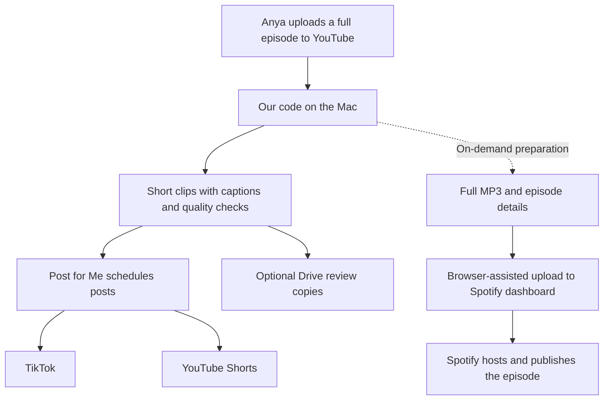

# Booboo Expansion Project

## Quick Read

PURSUIT's distribution program turns Anya's YouTube episodes into captioned TikToks, YouTube Shorts, and full podcast audio. It runs on the Mac; GitHub is the code and instruction manual.

**Monthly budget: about $10 plus your existing ChatGPT Plus subscription (used by Codex).** Cloudflare is expected to cost $0 at current usage, but storage/request overages can be billed. Taxes, optional upgrades and normal computer/internet costs are separate. Claude's exact plan price has not been verified.

| Tool | What it does | Monthly cost |
| --- | --- | --- |
| YouTube | Holds the original episodes and published Shorts | $0 additional required |
| Mac + our program | Downloads, transcribes, edits and converts files | $0 software fee |
| Codex CLI | Selects and checks short moments | Existing ChatGPT Plus subscription |
| Post for Me | Schedules and publishes TikToks and Shorts | $10 baseline |
| Cloudflare | Stores full MP3s and serves our RSS episode list | $0 expected initially; limits apply |
| Spotify | Hosts the show and its published audio for listeners | $0 required |
| Google Drive | Optional review copies of Shorts | $0 extra with sufficient storage |
| GitHub | Stores code, history and these instructions | $0 extra required |

**Your normal job:** upload the original to YouTube and keep the Mac awake/online. TikTok and weekly Shorts are enabled. **YouTube-to-Spotify is not automatic yet:** one real episode is live, but each new MP3 still needs a dashboard upload. Spotify hosting is preserved for monetization eligibility, not guaranteed earnings. The test episode is deleted; Cloudflare publishing is OFF. Shorts' Related video is optional and manual.

Prices checked October 8, 2026: [Post for Me](https://www.postforme.dev/pricing), [Cloudflare](https://developers.cloudflare.com/r2/pricing/). Detailed costs, schedules, setup and responsibilities are below.

---

## Deep Dive

### Current Deployment

**Where we are, October 8, 2026:**

| Destination | Current live Mac setting | What you do |
| --- | --- | --- |
| Original YouTube episode | Human upload; source for the program | Record/edit and upload the original episode |
| TikTok `@pursuitthepod` | Automatic posting enabled; up to 3/day at 9 AM, 3 PM and 9 PM Denver time | Maintain account connection and review results; no routine clip upload |
| YouTube Shorts `@AnyaPostnikov` | Weekly publisher enabled; up to 3/week, Mon/Wed/Fri at 5 PM Denver time | Maintain connection; set Related video in YouTube Studio when wanted |
| Spotify | Real 8:48 episode published directly in the existing Spotify-hosted show; unattended uploads not built | Use the dashboard upload flow for now; no hosting redirect needed |
| Google Drive | Optional review delivery enabled; previous test verified | Review/download copies if useful; refresh Google login if it expires |

Schedules are ceilings, not quotas: unsuitable or missing clips leave empty slots. The Mac must be awake and online to prepare new content. Clips already submitted to Post for Me can publish while it is off; existing Cloudflare audio remains available too.

**Frequency:** the Mac checks YouTube at 07:15, 10:15, 13:15, 16:15, 19:15 and 22:15 in its local time zone (currently Denver). Processing takes additional time. These are social-pipeline checks, **not automatic Spotify uploads**. Spotify currently has no recurring upload schedule.

**Read [Services, Costs, and What You Do](PROJECT_GUIDE.md)** for the detailed human guide: every service's purpose, monthly cost estimates, each platform's manual steps, what happens when the Mac is off, and the remaining Spotify setup. [Spotify Setup](SPOTIFY_SETUP.md) contains the technical account/deployment instructions.

For the earlier provider/security background, see [Post for Me and Connecting YouTube](POSTFORME.md).

## The Two Publishing Paths



**Published directly on Spotify:** [How to be More Consistent Than 99% of People](https://open.spotify.com/episode/2edCtALCfvqG6gR5WlwqsH), 8:48. The dashboard confirms Published. This was a browser-assisted upload, not a completed unattended uploader. Spotify hosting was preserved. The separate [Cloudflare RSS feed](https://pursuit-podcast.endlesspursuits-co.workers.dev/feed.xml) is online but is not connected to this show; redirecting to it is paused because of the monetization tradeoff.

## What Each Thing Does

| Thing | Plain-English job | Where it runs | When you need it |
| --- | --- | --- | --- |
| YouTube full episodes | The original video and the starting point for all distribution. | YouTube | Anya uploads each original episode here. |
| Our Python program / autopilot | Finds uploads, prepares content, checks quality, and sends finished files to the right service. | Your Mac | Automatically during scheduled runs; manually for troubleshooting. |
| macOS LaunchAgent | The alarm clock that starts the program at configured times. | Your Mac | Keep it installed; the Mac must be awake and online to do new work. |
| Codex CLI (Claude Code optional fallback) | Helps choose useful short moments and assess whether the clips make sense. | Called from the Mac using the ChatGPT-subscription login (no API key) | Maintain the ChatGPT login and available Codex usage. |
| Whisper, FFmpeg, OpenCV, yt-dlp | Transcribe speech, edit/convert files, inspect video, and retrieve the source episode. | Your Mac | No separate paid account; occasionally update them when downloading breaks. |
| Post for Me | Receives finished clips, holds their schedules, and posts them to the connected social accounts. | Post for Me's servers | Maintain one subscription and the TikTok/YouTube connections. |
| TikTok | Where viewers see the short clips. | TikTok | Check results, comments, and any account issues. |
| YouTube Shorts | Another destination for the short clips, on the existing PURSUIT YouTube channel. | YouTube, published through Post for Me | Review results and optionally set the Related video field. |
| Cloudflare R2 | The online shelf that stores the full MP3s, cover image, and episode list. | Cloudflare | Maintain the account/billing; check usage occasionally. |
| Cloudflare Worker | Serves the separate, optional RSS feed and MP3 files. | Cloudflare, at our `workers.dev` address | Deployed but not connected to this Spotify show; no domain purchase needed. |
| RSS feed | A public episode list containing the show details and links to each MP3. It is a file, not another service or subscription. | Generated by our code and served through Cloudflare | Optional external-hosting route only; not connected to the current Spotify-hosted show. |
| Spotify for Creators / Spotify | Hosts dashboard-uploaded episodes, playback, analytics and eligible monetization. | Spotify | Upload each episode for now; recurring unattended uploads still need implementation. |
| Google Drive | Optional review copies of finished Shorts and their posting text. | Google Drive | Use when Anya wants to inspect or manually reuse a clip. |
| GitHub | The shared code, change history, and instruction manual. | GitHub | Read setup instructions and keep code changes recorded. It does not run the daily program. |

Cloudflare stores and serves the podcast files. Our code decides what to publish and creates the RSS feed. Post for Me handles the short social videos, not Spotify audio. There is no additional managed podcast-host subscription in this workflow.

Earlier details about Post for Me's operator, account permissions and disconnecting YouTube are preserved in [Post for Me Background](POSTFORME.md). They are reference material, not another required service or setup task.

For the full budget, each platform's human steps and troubleshooting, see [Services, Costs, and What You Do](PROJECT_GUIDE.md). The technical reference below is retained for setup and maintenance.

## Technical Reference

The sections below cover installation, manual commands, account connections, testing and operation. The live Mac's settings and private files are separate from GitHub. Some earlier Shorts/Drive changes remain local and are not all committed, so the deployment snapshot above is not a claim that a fresh clone contains every live feature. See [GitHub versus the live Mac](PROJECT_GUIDE.md#github-versus-the-live-mac).

## Requirements

- Apple Silicon Mac (M1 or newer)
- macOS and Homebrew
- A ChatGPT Plus (or higher) subscription with the Codex CLI logged in via **Sign in with ChatGPT** (not an API key). Claude Code is optional and off by default.
- Approximately 2 GB for the Python environment and Whisper model, plus temporary space while an episode is processed
- For autopilot posting: your own Post for Me account/API key and your own YouTube, Instagram, and TikTok accounts
- Instagram must be a Professional account (Creator or Business) for API publishing

The core clipping workflow has no per-episode API bill beyond services you already use. Autopilot posting requires a Post for Me plan; pricing can change, so check its current pricing before subscribing. Codex usage is subject to your ChatGPT plan's Codex limits (see *AI provider* below).

## Installation

```bash
cd ~/Documents/PURSUIT_CLIPS_TOOL
./setup.sh
```

The setup script installs FFmpeg, `yt-dlp`, Deno, Python 3.12, the Python dependencies, and the Whisper model. It also installs the `pursuit-clips` launcher in `~/.local/bin`.

Then open a new Terminal window and log in to Codex once:

```bash
codex login
```

If the ChatGPT desktop app is installed, its bundled Codex CLI is found automatically and no install is needed. Choose **Sign in with ChatGPT** and complete the browser login. Check with `codex login status`; it must say it is logged in using ChatGPT. If the project folder moves, run `./setup.sh` again to refresh the launcher symlink.

## AI provider (Codex by default; Claude optional)

**Status: the Codex migration passed its initial tests but still needs verification during real scheduled runs.** A 2-call smoke test (one transcript analysis, one visual check of a finished clip) returned valid structured output and passed the existing score checks; the full unattended pipeline has not yet run on Codex alone.

All model calls (transcript analysis, clip selection, scoring, titles/captions/hashtags, and the final visual quality check) go through one file, `llm.py`. The prompts, `MIN_POST_SCORE`, and every other threshold and safety check are unchanged.

- **Codex uses your ChatGPT subscription**, not the billed OpenAI API. API-key environment variables (`OPENAI_API_KEY`, `CODEX_API_KEY`) are removed from every Codex call, and a Codex login that uses an API key is refused. If the ChatGPT desktop app is installed, its bundled Codex CLI is found automatically.
- **Claude is optional and OFF by default.** It is never used automatically. To use it as a fallback when Codex is unavailable, set `PURSUIT_LLM_FALLBACK=claude`; to make it the first choice, set `PURSUIT_LLM=claude`.
- **Usage limit or outage:** the run stops cleanly and tries again on a later run. The episode's retry attempts are not used, and nothing is published without the quality check.
- **Health checks cost nothing:** `codex login status` is used instead of a model call.
- **Tests never call a model.** Fake CLI scripts stand in for Codex and Claude: `python -m unittest discover -s tests`.

## Manual Workflow

The normal manual command is:

```bash
pursuit-clips "https://www.youtube.com/watch?v=VIDEO_ID"
```

Finished clips and posting copy are written under `~/Desktop/PURSUIT_CLIPS/`. Watch the clips, keep the good ones, and post them manually.

Useful existing options:

```bash
pursuit-clips "URL" --max 5
pursuit-clips "URL" --redo
pursuit-clips "URL" --video ~/Desktop/original.mp4
pursuit-clips ~/Desktop/local-episode.mp4
pursuit-clips "URL" --no-captions
pursuit-clips "URL" --keep-source
```

Running the same command after an interruption resumes from cached work. Completed source downloads are removed automatically; failed work keeps its source so it can resume.

## Autopilot Setup

Create the real social accounts before starting this section. Do not use personal accounts by mistake.

1. Create or finish the PURSUIT TikTok account.
2. Create or finish the PURSUIT Instagram account and make it a Professional Creator or Business account.
3. Confirm you can log in to the intended PURSUIT YouTube, Instagram, and TikTok accounts in the browser.
4. Set the TikTok and Instagram bio/website link to `https://www.youtube.com/@AnyaPostnikov`. Post for Me publishes posts but does not edit profile bios, so this is a one-time manual account setting.
5. Create a Post for Me project and copy its API key.
6. Run setup:

```bash
cd ~/Documents/PURSUIT_CLIPS_TOOL
./autopilot setup
```

The API key is entered without echo and stored in macOS Keychain, not in this repository. Setup reads the accounts already connected in the Post for Me dashboard and enables a platform **only** if its handle matches the expected one (`EXPECTED_USERNAMES` in `autopilot.py`; currently TikTok `@pursuitthepod`). Anything else is listed but not used. To open a connect flow from here: `./autopilot setup --connect youtube instagram`. The tool refuses to guess when multiple accounts for one platform are connected.

The optional `PURSUIT_POSTFORME_KEY` environment variable is supported for development, but Keychain is the recommended local setup. Never commit a real `.env` file.

## Going Live (once)

1. Verify the account without publishing (uploads a clip, creates a Post for Me draft, deletes it):

   ```bash
   ./autopilot test-post
   ```

2. One controlled real post. It picks the best approved clip, shows the clip, caption, destination and time, opens the MP4, and schedules it 20 minutes out only if you type `POST ONE CLIP`:

   ```bash
   ./autopilot live-test
   ```

3. When the post appears on TikTok, turn on the hands-off system:

   ```bash
   ./autopilot auto-post on
   ```

   It first checks with Post for Me that the live test actually published, and refuses otherwise.

## What Runs Automatically

A LaunchAgent (`./install_autopilot.sh`, already installed) runs at 7:15, 10:15, 13:15, 16:15, 19:15 and 22:15 local time. It is loaded again at login, runs immediately when loaded, and launchd coalesces missed calendar runs into one run after wake. Each run does these steps independently, so one failing step never blocks the others:

1. **Checks earlier posts.** It asks Post for Me what happened and records the links. Failures trigger a Mac notification.
2. **New episodes:** detects new PURSUIT uploads before filling the schedule and turns their good moments into approved clips. Fresh clips get priority.
3. **Keeps 3 posts scheduled ahead** (auto-posting only) in the 9:00, 15:00 and 21:00 slots, up to 3 TikToks a day. Three is a ceiling, not a quota: an empty buffer leaves the slot empty. The posts sit on Post for Me's servers, so they go out even if the Mac is asleep or offline.
4. **Back catalog:** processes one old episode per run (newest first) whenever fewer than 12 approved clips (about four days at the ceiling) are waiting.
5. **Tops the schedule up again** with anything new.

For every clip:

- **Quality control:** a clip only becomes "approved" if it passes the full quality control (the AI's score ≥ 70 and standalone ≥ 7, technical checks, and the AI's visual check of the finished video).
- **Choosing what to post:** the best approved clip goes first. The same episode or topic is avoided back to back.
- **When nothing good is left:** if nothing approved is available, the slot is skipped. Nothing weak is ever posted to fill it.
- **Never twice:** a moment is never posted twice. Each post records the episode and time range, and anything overlapping an earlier post is dropped.
- **Removing a clip:** deleting a clip's folder removes it before it's posted.

**Resilience:**
- **Resuming work:** interrupted downloads, transcripts and renders resume from cache.
- **Outages:** an AI (including a Codex usage limit) or internet outage skips processing for that run without using up an episode's retry attempts. Episodes that fail 3 times get retried after 7 days.
- **Unclear replies:** an ambiguous Post for Me response is recorded and looked up by its unique ID next run, never re-posted blindly.

**Adding Instagram/YouTube later:** connect the account in Post for Me, add its expected handle to `expected_usernames` in `~/Library/Application Support/PURSUIT_AUTOPILOT/config.json`, and run `./autopilot setup`. The same clips then go to every verified account.

```bash
./autopilot status            # what's scheduled / posted / waiting (also ~/Desktop/PURSUIT_CLIPS/AUTOPILOT_STATUS.txt)
./autopilot pause | resume    # stop/start new work (already-scheduled posts still go out)
./autopilot auto-post off     # stop scheduling new posts
./install_autopilot.sh --remove
```

Runtime data is stored outside the repository:

- State, approved queue, post ledger, pinned account IDs: `~/Library/Application Support/PURSUIT_AUTOPILOT/`
- API key: macOS Keychain
- Logs: `~/Library/Logs/pursuit-autopilot.log`
- Clips/status: `~/Desktop/PURSUIT_CLIPS/`

## Manual YouTube Shorts via Google Drive

A separate **delivery** workflow: finished Shorts plus ready-to-copy YouTube text go into one Google Drive folder, **PURSUIT - Shorts Ready to Post**. Anya downloads the videos and posts them from her phone. The tool never publishes to YouTube.

```bash
./autopilot export-shorts latest 3             # package up to 3 Shorts from the latest episode, locally only
./autopilot export-shorts latest 3 --deliver   # ...and upload them to the Drive folder
./autopilot drive-status                       # folder, auth, Shorts available, storage, next cleanups
./autopilot cleanup-drive                      # remove expired deliveries now (also runs automatically)
./autopilot drive-auto on|off                  # one batch per NEW episode, from the scheduled runs
```

- **Choosing the Shorts:** up to 3 of the latest episode's clips that passed the normal QC. They're taken best first, never overlapping in time, and audio-only (logo) layouts are skipped. If only 2 pass, you get 2.
- **Reusing existing work:** it reuses the production transcript, AI analysis and QC verdicts. If a chosen clip's MP4 was already cleaned up after TikTok posted it, only that clip is re-rendered, using the same lock as the scheduled runs.
- **Files in Drive:** `YYYY-MM-DD 01_<title>.mp4` (up to 03) and `YYYY-MM-DD POSTING_INFO.txt`. The info file has the title, description, hashtags, source episode, episode link, the channel (https://www.youtube.com/@AnyaPostnikov) and the timestamp range.
- **One batch per episode:** an interrupted upload resumes, and it adopts files that already reached Drive instead of uploading them again.
- **Separate from TikTok:** it never calls Post for Me, and it never reads-for-writing or changes the TikTok ledger, queue, config or episode state. Its own state is in `~/Library/Application Support/PURSUIT_AUTOPILOT/drive/`.

**Retention (14 days).** Every uploaded file's Drive ID and delivery time are recorded. After 14 days a file is moved to Drive's trash, but only if Drive still shows it inside the delivery folder, tagged as created by this tool for that delivery. Anything uncertain is left alone and reported. The Google permission used (`drive.file`) only lets this app see files it created itself. Local staging copies are removed after a verified upload, and any left over are pruned after 14 days. Production clips are never deleted by this feature.

### One-time Google Drive setup

1. Go to https://console.cloud.google.com/ and create a project (for example "PURSUIT Shorts").
2. **APIs & Services → Library →** enable **Google Drive API**.
3. **APIs & Services → OAuth consent screen:** choose External and fill in the app name and your email. Under **Audience**, set Publishing status to **In production**; in "Testing", Google expires the sign-in every 7 days. The only scope used is `drive.file`, which needs no Google review.
4. **APIs & Services → Credentials → Create credentials → OAuth client ID →** Application type **Desktop app →** Create **→ Download JSON.**
5. Run:

   ```bash
   ./autopilot drive-setup --client-secret ~/Downloads/client_secret_XXXX.json
   ```

   Your browser opens. Sign in with your own Google account and allow access (Google may warn that the app is unverified; choose **Advanced → Go to …**). No password is ever typed into the tool. The OAuth client and sign-in token are stored in `~/Library/Application Support/PURSUIT_AUTOPILOT/drive/` with owner-only permissions, and you can delete the downloaded JSON afterwards.
6. Share the printed folder link with Anya (Drive → folder → Share).
7. Run `./autopilot drive-test`. It builds one Short, shows the exact file and Drive destination, uploads only after you type `UPLOAD TEST SHORT`, and verifies the file in Drive. `--deliver` and `drive-auto on` stay locked until this succeeds.

## Spotify: Current Publication and Automation

**Working now:** the [real 8:48 episode](https://open.spotify.com/episode/2edCtALCfvqG6gR5WlwqsH) is Published; the 27-second test is deleted. Code prepared the full MP3 and episode details, then a browser-assisted dashboard upload published it. Spotify still hosts the show; no redirect was applied.

**Not automatic yet:** a new YouTube episode does not trigger a Spotify publication. Prepare its MP3 with `./autopilot podcast-prepare latest --download`, upload it and its copy in the existing Spotify dashboard, then confirm Published and public playback. The current length filter accepts regular videos at least six minutes long; it does not identify podcast content by genre.

**Before calling it hands-off:** build and schedule a reliable dashboard uploader, add duplicate/retry checks and login-interruption handling, then verify a future YouTube upload reaches Spotify exactly once. No recurring Spotify job or upload frequency is enabled today.

**Monetization:** keeping Spotify hosting preserves that eligibility requirement; Anya must still qualify, apply and complete payouts in Spotify's Monetize section. Eligible audio can earn ad revenue; Premium video revenue requires video, not this MP3. Publishing alone does not start earnings. See [Spotify's current requirements](https://support.spotify.com/us/creators/article/spotify-partner-program/).

The [Cloudflare RSS feed](https://pursuit-podcast.endlesspursuits-co.workers.dev/feed.xml) works independently but is disconnected and its publishing branch is OFF. Do not redirect this show to it: Spotify's warning removes Spotify-hosted ads eligibility. [Next steps](PROJECT_GUIDE.md#current-spotify-publication-and-next-steps) explain the chosen route; [Spotify Setup](SPOTIFY_SETUP.md) retains optional external-RSS reference only.

## Safety

- **Fail closed:** unexpected pipeline or API responses stop posting.
- **Strict accounts:** every configured ID must still be connected, match its platform, and have the expected handle. Platforms without a verified handle are never posted to.
- **Duplicate protection:** a local atomic ledger, deterministic external IDs, remote lookup, and a process lock prevent blind reposting.
- **Safe retries:** ambiguous network results are recorded and reconciled before another create attempt.
- **Private atomic state:** state and ledger files are written atomically with mode `0600`.
- **Real dry runs:** dry-run processing does not alter production state or call posting endpoints.
- **Explicit live test:** the one-clip live test requires an exact interactive confirmation.
- **No channel administration:** the tool does not use YouTube write/delete APIs and cannot edit or delete existing channel videos.
- **One canonical funnel:** generated TikTok/Instagram copy always directs viewers to `https://www.youtube.com/@AnyaPostnikov`.

Posts already scheduled on Post for Me are controlled by Post for Me. Pausing or uninstalling this local tool does not cancel them; use the Post for Me dashboard when cancellation is required.

## Quality Control

Every candidate must pass codec, dimensions, duration, full-decode, audio, transcript-boundary, repetition, speech-rate, score, and standalone checks. Codex also inspects frames from the finished clip. If source captions are already burned in, the pipeline rerenders from a safer crop and checks again.

The system is deliberately conservative, but editorial quality is subjective. Watch the first controlled live-test clip before enabling unattended posting. YouTube's **Related video** field still needs to be set manually in YouTube Studio after each Short is published.

## Current Limitations

- Built for Apple Silicon and the PURSUIT channel configuration in `autopilot.py`.
- Codex (ChatGPT) and platform OAuth sessions can expire and require interactive login again.
- `yt-dlp` occasionally needs an update when YouTube changes its site.
- Automated framing works best with a clearly visible primary speaker.
- Post for Me and social platforms may change APIs, pricing, or publishing rules.
- Full source downloads and rejected clips are cleaned after completed jobs. An approved MP4 is retained until Post for Me confirms it was published, then removed automatically.

## Tests

Tests use generated media and a local fake Post for Me server. They do not contact real social accounts:

```bash
.venv/bin/python -m unittest discover -s tests -v
```

## Credentials Warning

You must supply and authorize your own API credentials and social accounts. Never commit API keys, OAuth tokens, cookies, `.env` files, runtime state, logs, transcripts, source media, or generated clips. The included `.env.example` contains placeholders only; the default setup uses macOS Keychain.
